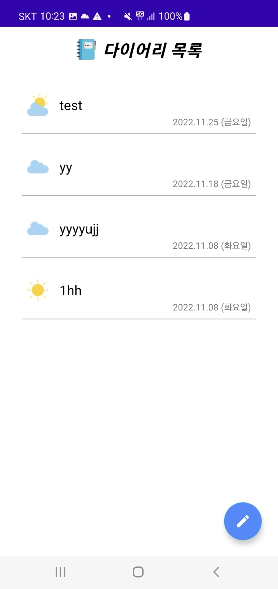
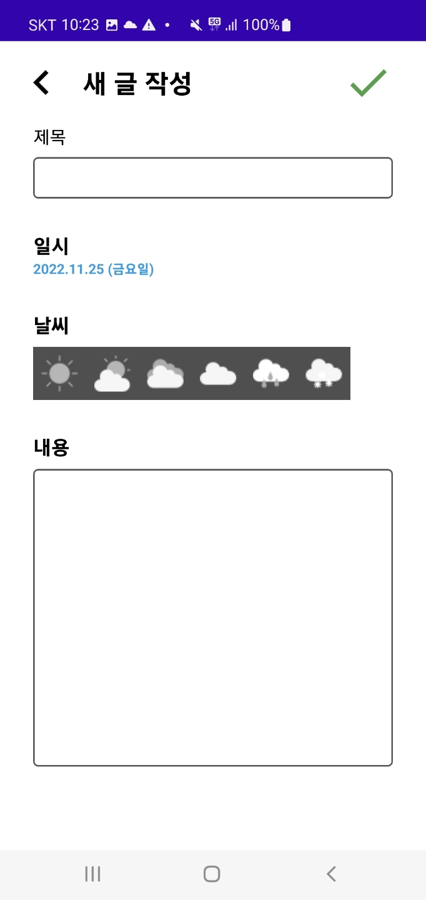
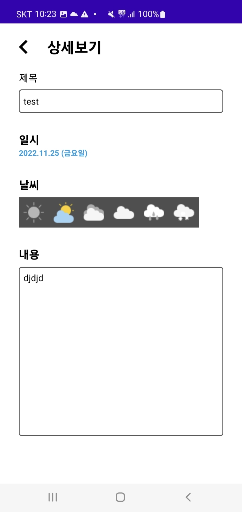

<h1 style="text-align: center;"> You can write a brief diary! </h1>

```
https://play.google.com/store/apps/details?id=com.donggu.diary
```


<h1 style="text-align: center"> List Page </h1>


<h1 style="text-align: center"> Writing Page  </h1>


<h1 style="text-align: center"> Reading Page  </h1>


